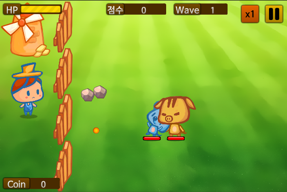

# 게임 플레이 UI 구성



[완성된 panel](prefab/InGameSet.unitypackage)


### 농장 체력 표시

* UI 리소스 추가
  * [github 소스 3-3/inGameUI/](https://github.com/wikibook/ngui/tree/master/3-3/inGameUI)
  * 위 리소스를 프로젝트 브라우저 Assets/UI/ 폴더로 모두 복사
* InGameAtlas 생성
  * Assets/UI/UIResource 폴더의 모든 이미지를 선택하여 추가
* NGUI 2D UI 생성
  * Transform Position (28, 0, 0)
  * Constrained 960x640


표 3-19: UISprite 컴포넌트 설정(HPBar)

| 속성 | 값 |
| ---|:---:|
|Atlas|InGameAtlas|
|Sprite|BarBorder|
|Type|Sliced|
|Fill Center|체크|
|Depth|2|
|Size|150x38|
|Color Tint|73, 44, 0, 255|

* BarBorder 스프라이트 Border 10, 10, 10, 10으로 편집


표 3-20: UISprite 컴포넌트 설정(BarFill)

| 속성 | 값 |
| ---|:---:|
|Atlas|InGameAtlas|
|Sprite|BarPattern|
|Type|Filled|
|Depth|1|
|Size|140x24|
|Color Tint|255, 216, 0, 255|


표 3-21: UISprite 컴포넌트 설정(BarBG)

| 속성 | 값 |
| ---|:---:|
|Atlas|InGameAtlas|
|Sprite|FillRect|
|Type|Sliced|
|Fill Center|체크|
|Depth|0|
|Size|140x32|
|Color Tint|174, 0, 0, 255|

* FillRect 스프라이트 Border 10, 10, 10, 10으로 편집


표 3-22: UISprite 컴포넌트 설정(titleBG)

| 속성 | 값 |
| ---|:---:|
|Atlas|InGameAtlas|
|Sprite|ShadowRect|
|Type|Sliced|
|Fill Center|체크|
|Depth|3|
|Color Tint|128, 82, 0, 255|
|Anchors Type|Unified|
|Execute|OnEnable|
|Target|HPBar 게임 오브젝트|
|Left|Target’s Left|-55|
|Right|Target’s Left|15|
|Bottom|Target’s Bottom|-5|
|Top|Target’s Top|5|

* ShadowRect 스프라이트 Border 10, 10, 10, 10으로 편집


표 3-23: UILabel 컴포넌트 설정(titleLabel)

| 속성 | 값 |
| ---|:---:|
|Font|NanumBarunGothicBold 끌어다 놓기|
|Font Size|30|
|Text|HP|
|Overflow|ResizedFreely|
|Keep crisp|Never|
|Depth|4|
|Color Tint|255, 255, 255, 255|


* HPBar 구조
```
	HPBar
		BarBG
		BarFill
		titleBG
			titleLabel
```


표 3-24: UISprite 컴포넌트 설정(HPBar)

| 속성 | 값 |
| ---|:---:|
|Anchors Type|Unified|
|Execute|OnEnable|
|Target|Panel 게임 오브젝트|
|Left|Target’s Left|60|
|Right|Target’s Left|210|
|Bottom|Target’s Top|-48|
|Top|Target’s Top|-10|

* BarFill 게임 오브젝트에 경계선이 보이면 BarPattern 스프라이트 Border 1, 1, 1, 1로 수정


* HPBar 게임 오브젝트에 UISlider 컴포넌트 추가
  * NGUI - Attach - Slider Script 실행
  * Forground : BarFill 게임오브젝트
  * Direction : LeftToRight

---

### 점수 표시

* HPBar 게임오브젝트 복사 후 ScoreBar로 명명
  * UISlider 컴포넌트 제거
  * BarFill, BarBG 게임오브젝트 제거
  * Sprite : FillRect 로 변경
    * Border 10, 10, 10, 10 수정

표 3-25: UILabel 컴포넌트 설정(titleLabel)

| 속성 | 값 |
| ---|:---:|
|Text|점수|


표 3-26: UILabel 컴포넌트 설정(ScoreLabel)

| 속성 | 값 |
| ---|:---:|
|Font|NanumBarunGothicBold 끌어다 놓기|
|Font Size|28|
|Text|0|
|Overflow|ResizedFreely|
|Depth|5|
|Color Tint|255, 255, 255, 255|

표 3-27: UISprite 컴포넌트 설정(ScoreBar)

| 속성 | 값 |
| ---|:---:|
|Anchors Type|Unified|
|Execute|OnEnable|
|Target|Panel 게임 오브젝트|
|Left|Target’s Center|-75|
|Right|Target’s Center|75|
|Bottom|Target’s Top|-48|
|Top|Target’s Top|-10|

* ScoreBar 구조
```
	ScoreBar
		titleBG
			titleLabel
		ScoreLabel
```

---

### 적 웨이브 표시

* ScoreBar 게임오브젝트 복사 후 WaveBar로 명명

표 3-28: UILabel 컴포넌트 설정(titleLabel)

| 속성 | 값 |
| ---|:---:|
|Text|Wave|

표 3-29: UISprite 컴포넌트 설정(titleBG)

| 속성 | 값 |
| ---|:---:|
|Anchors Type|Unified|
|Execute|OnEnable|
|Target|WaveBar 게임 오브젝트|
|Left|Target’s Left|-85|
|Right|Target’s Left|15|
|Bottom|Target’s Bottom|-5|
|Top|Target’s Top|5|


표 3-30: UISprite 컴포넌트 설정(WaveBar)

| 속성 | 값 |
| ---|:---:|
|Anchors Type|Unified|
|Execute|OnEnable|
|Target|Panel 게임 오브젝트|
|Left|Target’s Right|-300|
|Right|Target’s Right|-200|
|Bottom|Target’s Top|-48|
|Top|Target’s Top|-10|

* WaveBar 구조
```
	WaveBar
		titleBG
			titleLabel
		WaveLabel
```

### 일시 정지, 배속 변경 버튼 추가


표 3-31

| 속성 | 값 |
| ---|:---:|
|Atlas|InGameAtlas|
|Sprite|ShadowRect|
|Type|Sliced|
|Fill Center|체크|
|Depth|2|
|Color Tint|255, 195, 0 , 255|
|Anchors Type|Unified|
|Execute|OnEnable|
|Target|Panel 게임 오브젝트|
|Left|Target’s Right|-80|
|Right|Target’s Right|-10|
|Bottom|Target’s Top|-80|
|Top|Target’s Top|-10|

표 3-32

| 속성 | 값 |
| ---|:---:|
|Atlas|InGameAtlas|
|Sprite|pause|
|Type|Sliced|
|Fill Center|체크|
|Depth|3|
|Size|35x40|
|Color Tint|0, 0, 0 , 255|


표 3-33

| 속성 | 값 |
| ---|:---:|
|Color Tint|255, 111, 0, 255|
|Anchors Type|Unified|
|Execute|OnEnable|
|Target|PauseButton 게임 오브젝트|
|Left|Target’s Left|-80|
|Right|Target’s Left|-10|
|Bottom|Target’s Bottom|0|
|Top|Target’s Top|0|

표 3-34

| 속성 | 값 |
| ---|:---:|
|Font|NanumBarunGothicBold 끌어다 놓기|
|Font Size|30|
|Text|x1|
|Overflow|ResizedFreely|
|Gradient|체크 해제|
|Depth|3|
|Color Tint|0, 0, 0, 255|


### 일시 정지 화면 구성

표 3-35

| 속성 | 값 |
| ---|:---:|
|Atlas|InGameAtlas
|Sprite|ShadowRect
|Type|Sliced
|Fill Center|체크
|Depth|8
|Size|360x200
|Color Tint|255, 195, 0 , 255

표 3-36

| 속성 | 값 |
| ---|:---:|
|Atlas|InGameAtlas
|Sprite|FillRect
|Type|Sliced
|Fill Center|체크
|Depth|7
|Color Tint|0, 0, 0 , 138
|Anchors Type|Unified
|Execute|OnEnable
|Target|Panel 게임 오브젝트
|Left|Target’s Left|0
|Right|Target’s Right|0
|Bottom|Target’s Bottom|0
|Top|Target’s Top|0


표 3-37

| 속성 | 값 |
| ---|:---:|
|Font|NanumBarunGothicBold 끌어다 놓기
|Font Size|40
|Text|Pause
|Overflow|ResizedFreely
|Gradient|체크
|Effect|Outline
|Effect Color|0, 0, 0, 255
|Effect X, Y|1, 1
|Depth|9
|Color Tint|255, 255, 255, 255


표 3-38

| 속성 | 값 |
| ---|:---:|
|Atlas|InGameAtlas
|Sprite|ShadowRect
|Type|Sliced
|Fill Center|체크
|Depth|9
|Size|70x70
|Color Tint|255, 255, 255, 255


표 3-39

| 속성 | 값 |
| ---|:---:|
|Atlas|InGameAtlas
|Sprite|play
|Type|Simple
|Depth|10
|Size|35x40
|Color Tint|0, 0, 0, 255


표 3-40

| 속성 | 값 |
| ---|:---:|
|Font|NanumBarunGothicBold 끌어다 놓기
|Font Size|25
|Text|돌아가기
|Overflow|ResizedFreely
|Gradient|체크 해제
|Depth|10
|Color Tint|0, 0, 0, 255


표 3-41

| 속성 | 값 |
| ---|:---:|
|Atlas|InGameAtlas
|Sprite|reload
|Type|Simple
|Depth|10
|Size|40x40
|Color Tint|0, 0, 0, 255


표 3-42

| 속성 | 값 |
| ---|:---:|
|Font|NanumBarunGothicBold 끌어다 놓기
|Font Size|25
|Text|다시시작


표 3-43

| 속성 | 값 |
| ---|:---:|
|Atlas|InGameAtlas
|Sprite|house
|Type|Simple
|Depth|10
|Size|40x40
|Color Tint|0, 0, 0, 255


표 3-44

| 속성 | 값 |
| ---|:---:|
|Font|NanumBarunGothicBold 끌어다 놓기
|Font Size|25
|Text|처음으로


### 적 캐릭터 체력 표시


표 3-45

| 속성 | 값 |
| ---|:---:|
|Atlas|InGameAtlas
|Sprite|BarBG
|Type|Sliced
|Fill Center|체크
|Depth|6
|Size|60x14
|Color Tint|0, 0, 0, 255

표 3-46

| 속성 | 값 |
| ---|:---:|
|Atlas|InGameAtlas
|Sprite|enemyHP
|Type|Sliced
|Fill Center|체크
|Depth|7
|Size|56x10
|Color Tint|255, 255, 255, 255

